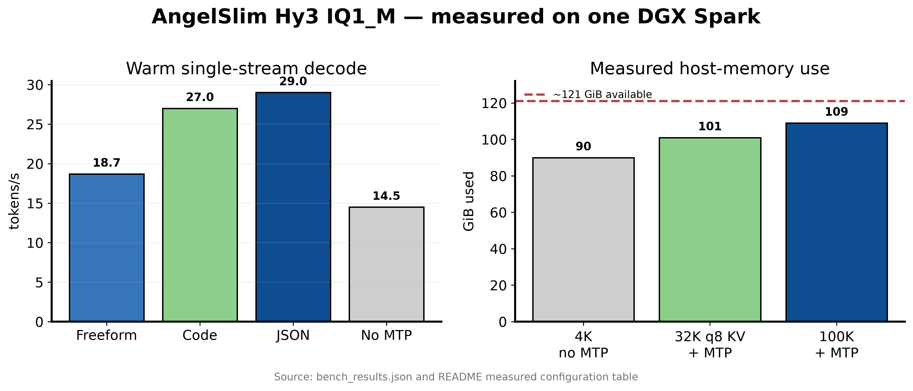

# AngelSlim Hy3 IQ1_M MTP — DGX Spark (GB10)

Ready-to-run **deployment package** for [AngelSlim/Hy3-GGUF](https://huggingface.co/AngelSlim/Hy3-GGUF) `Hy3-IQ1_M-mtp.gguf` on a single **NVIDIA DGX Spark / GB10** (128 GB unified memory).

This is **not** new weights. It is a measured host recipe: patched `llama.cpp` (hy_v3 + MTP), download steps, serve flags, and honest numbers from a live GB10 box.

## Benchmark visualization

[](figures/benchmark-summary.pdf)

The figure is generated from this repository's measured results with [`figures/plot_benchmarks.py`](figures/plot_benchmarks.py), following the publication-figure conventions from [figures4papers](https://github.com/ChenLiu-1996/figures4papers). The PNG is optimized for GitHub; click it for the vector PDF.


## What this is (and is not)

| Claim | Status |
|-------|--------|
| Fits on one GB10 | **Yes** (~109 Gi host / ~106 Gi process at 100k ctx + MTP) |
| Coherent English / code / JSON | **Yes** |
| 100k context capacity | **Yes** (allocated; short gens do not fill it) |
| Warm freeform decode ~18–19 tok/s | **Yes** (best knobs) |
| Structured (code/JSON) ~26–30 tok/s | **Yes** when MTP draft accept is high |
| Freeform 30–50 tok/s | **No** on this IQ1_M quant |
| Concurrent 4/10 multi-slot | **Not claimed** — only `parallel=1` was validated |

If you need a fast daily-driver chat model on Spark, use a smaller NVFP4 package (e.g. Qwen3.6 MoE). This package is for **running Hy3 295B-class IQ1_M + MTP on one Spark** with realistic expectations.

## Hardware measured

- Host: DGX Spark / GB10, ~121 Gi unified RAM, CUDA 13 / driver 580
- Model file: `Hy3-IQ1_M-mtp.gguf` (~85.4 Gi / 91756066624 bytes)
- Runtime: AngelSlim `setup_hyv3_llama.sh` pin `19bba67c1` + patches `01-hyv3-arch` / `02-hyv3-mtp-tools`, CUDA build

## Best measured serve config

```bash
# after build + download (see start.sh)
./llama-server \
  -m /path/to/Hy3-IQ1_M-mtp.gguf \
  --host 0.0.0.0 --port 8088 \
  --ctx-size 100000 \
  --parallel 1 \
  --n-gpu-layers 999 \
  --flash-attn on \
  --cache-type-k q4_0 \
  --cache-type-v q4_0 \
  --spec-type draft-mtp \
  --spec-draft-n-max 2 \
  --spec-draft-n-min 1 \
  --spec-draft-p-min 0.6 \
  --cache-type-k-draft q4_0 \
  --cache-type-v-draft q4_0 \
  --jinja \
  --chat-template-file /path/to/hyv3_opensource_chat_template.jinja \
  --metrics --no-webui
```

**Why these knobs (measured):**

- **`n_max=2` + `p_min=0.6`** beat `n_max=3/5` and `p_min=0` on freeform (filters bad drafts).
- **q4_0 KV** keeps 100k + MTP draft KV on one Spark (~12 Gi available host headroom).
- **q8_0 KV** at 32k did **not** improve freeform tok/s.
- **No MTP** is flat ~14–15 tok/s on prose/code/json — MTP is required for structured speedups.

## Measured results (GB10, 2026-07-14)

Single stream, warm-ish after short prompts. Server timings where noted.

### Best config (`100k` + MTP `n_max=2` `p_min=0.6` + q4 KV)

| Workload | Decode (tok/s) | Draft accept (server) | Notes |
|----------|----------------|------------------------|-------|
| Freeform prose (short) | **~18–19** | ~0.82 | Warm single-stream headline |
| Freeform prose (~200 words) | **~18.7** | ~0.70 | Sustained longer gen |
| Code (`fib`) | **~26–28** | ~0.91–0.92 | Structured helps MTP |
| JSON only | **~27–30** | ~1.00 | Highest accept |
| ~20k-token filled prompt | encode **~297**, decode **~11** | ~0.43 | Capacity stress; host stayed up |

### Baselines (same box)

| Config | Freeform | Code | JSON |
|--------|----------|------|------|
| 4k, **no MTP** | ~14.8 | — | — |
| 100k, **no MTP** | ~14–15 | ~14–15 | ~14–15 |
| 100k, MTP `n_max=3` `p_min=0` | ~14–16 freeform | ~26 | ~33 |
| 4k, MTP `n_max=5` | **worse** freeform (~12–14) | ~22 | ~26 |

### Capacity / host

| Config | Host used | GPU process | Notes |
|--------|-----------|-------------|-------|
| 4k no MTP | ~90 / 121 Gi | ~88 Gi | Quiet idle load |
| 100k + MTP | ~109 / 121 Gi | ~106 Gi | MTP draft ctx estimate ~9.4 Gi |
| 32k q8 KV + MTP | ~101 / 121 Gi | — | More headroom, no freeform win |

**Concurrent:** only `--parallel 1` was exercised. Do not assume multi-slot stability.

Full machine-readable snapshot: [`bench_results.json`](./bench_results.json).

## Quick start

```bash
# 1) Clone package
git clone https://github.com/gitcommit90/angelslim-hy3-iq1m-mtp-dgx-spark.git
cd angelslim-hy3-iq1m-mtp-dgx-spark

# 2) Download GGUF + AngelSlim scripts (~86G free disk needed beyond build tree)
./download.sh

# 3) Build patched llama.cpp (needs CUDA nvcc on PATH, aarch64 GB10)
./build.sh

# 4) Serve (stops nothing else — free GPU yourself first)
./start.sh

# 5) Smoke
curl -sS http://127.0.0.1:8088/v1/models | head
python3 bench_probe.py
```

Default data dir: `~/llm/hy3-gguf` (override with `HY3_DIR`).

## Files

| File | Role |
|------|------|
| `download.sh` | HF download of GGUF + template + patches + setup script |
| `build.sh` | AngelSlim pin + CUDA build of `llama-server` |
| `start.sh` / `stop.sh` | Launch / stop best measured config on `:8088` |
| `bench_probe.py` | Short prose/code/json probe |
| `bench_results.json` | Honest measured table from GB10 |
| `.gitignore` | Do not commit the 85G GGUF |

## Disk / safety

- GGUF alone is **~86 Gi**. Keep ≥100 Gi free before download.
- Stop other large models first (e.g. vLLM on `:8000`) so you do not stack ~100 Gi + ~86 Gi.
- First load takes ~6–8 minutes (memory fit + warmup). `/v1/models` returns 503 until ready.
- Put `nvcc` on `PATH` (`/usr/local/cuda/bin`) or build fails with missing `CMAKE_CUDA_COMPILER`.

## Upstream

- Weights: [AngelSlim/Hy3-GGUF](https://huggingface.co/AngelSlim/Hy3-GGUF) (Apache-2.0, base `tencent/Hy3`)
- Base model: [tencent/Hy3](https://huggingface.co/tencent/Hy3)
- Build pin + patches: AngelSlim `setup_hyv3_llama.sh` / `patches/*`

## License

Package scripts: MIT. Model weights remain under their upstream licenses (Apache-2.0 on the AngelSlim GGUF card as of packaging).
